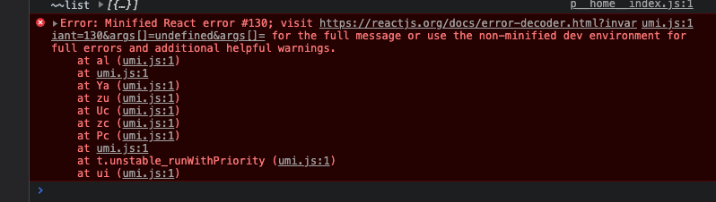

记录一次线上发布事故

自己在本地运行正常的代码。发布线上后，引起其他页面模块的报错

报错提示为 
- 

我擦，急了。为什么没有改动其他页面，却会在其他页面报错？？？？
猜测是打包问题。但是毫无头绪。。。。
google了一轮，全是import 相关 是否加花括号或者大小写问题 ？？？

后来锁定到import 语句  导入了一个本地900k的图片。将本体静态资源图片进行了压缩，50k以内。

正常了！！！

