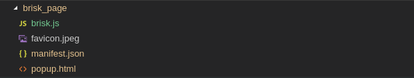

每次百度搜索，搜索结果的右边总是出现些乱七八糟的搜索热点（推的都是些什么玩意，高校替课和我有毛关系，几个悲伤的热点我用星号顶掉了）。
在这里插入图片描述

强迫症想把它隐藏掉，我用的是 chrome 浏览器，受 adblock（超强屏蔽广告插件）的启发，想到做浏览器插件的方式。
   本文简单记录一下插件开发过程，chrome 插件开发真的非常简单，只需要一点点前端的知识就可以了，以下是本次插件开发、打包、安装全部过程。

一、插件介绍
chrome 插件，即 chrome 扩展程序，地址栏输入 chrome://extensions 即可查看已安装的插件(比如下图中的第二个就是本次开发的插件):
在这里插入图片描述

二、插件开发

1. 准备工作　仅需安装 chrome 浏览器以及一个文本编辑器即可。

2. 创建一个文件夹，随意起你喜欢的名字，这里我创建的是‘brisk_page’，意为＂清新网页＂

3. 创建名为配置 manifest.json 文件。配置文件是插件的核心部分，其内容是 json 格式的，很类似前端项目包管理的 package.json。该文件内容大概如下，每一项的含义都注释了：

{
"name": "BriskPage", //　插件名称
"version": "0.0.8",　// 插件版本号
"manifest_version": 2,　// chrome18 以后要求必须设置,不然打包会报错
"description": "control the web page with CSS",　// 对插件的简单描述,本插件是通过 CSS 来简单控制页面那些元素隐藏
"browser_action": {　// 配置插件的一些资源地址
"default_icon": "favicon.jpeg",　// 图标，需要提供图标文件
"default_title": "清新网页",　// 标题
"default_popup": "popup.html"　// 弹窗文件，就是点击插件图标，需要提供 popup.html 文件
},
"content_scripts": [ // 该项可无，不过如果我们想操作页面 dom 的话，是需要配置的
{
"matches": ["*://www.baidu.com/*"], // 对于百度站点网页，注入 brisk.js
"js": ["brisk.js"]
}
]
} 4. 根据配置文件将图标文件、弹窗文件、js 文件放到插件文件夹下：

- 

5. 编写 js 代码

代码非常简单，就是动态创建一个 style 标签，把隐藏 Dom 相应的 CSS 写入后，插入原网页，这样就能达到隐藏相应 dom 的目的啦，这里有个细节点的东西就是观察原网页变化，使用了 MutationObserver 实例对象，当页面中 Dom 发生变化时，检查页面内是否有我们插入的 style 标签，有就不作任何处理，没有则插入。代码如下：

// brisk.js
function hideDom () {
if (document.querySelector('style[brisk]')) return
let style = document.createElement('style')
style.setAttribute('type', 'text/css')
style.setAttribute('brisk', true)
style.innerHTML = ".FYB_RD { display:none }"
document.head.appendChild(style)
}

let mutationObserver = window.MutationObserver
let observer = new MutationObserver(hideDom)
observer.observe(document, { childList: true, subtree: true }) 6. 编写弹窗代码

弹窗是插件与用户交互的界面，就像正常的 html 页面一样，不过这里不用写<head><body>等标签，直接写 html 代码即可,本插件目前暂无什么交互，所以代码简单明了，仅仅说明插件功能：

<meta charset="UTF-8">

  
欢迎使用"清新网页"插件

  

    
插件功能如下：

    <ol>
      <li>屏蔽百度推荐搜索热点</li>
    </ol>
  

最后需要一个图标文件，安装后将会显示在浏览器的右上角作为插件的入口：
在这里插入图片描述

至此，一个完整的插件就开发好了，麻雀虽小，五脏俱全，可以搞事情了。

三、插件打包
进入 chrome://extensions/页面，点击右上角开发者模式，开启后就会看到弹出的菜单栏，点击打包扩展程序。
在这里插入图片描述

弹出界面内需要填写两个地址，第一个是扩展程序根目录（即 brisk_page）。第二个是密钥文件，第一次不用填，会生成密钥文件，文件地址与扩展程序根目录同级。
在这里插入图片描述

点击打包扩展程序,就会发现和 brisk_page 同级会生成一个 crx 文件，即扩展程序包:
在这里插入图片描述

四、安装
   从文件夹将此文件拖入扩展程序页面即可安装！不出意外，已经可以看到效果了。

安装插件之前 安装插件之后
在这里插入图片描述
在这里插入图片描述
本文要介绍的内容就到此了，其实 chrome 插件没有什么技术难度，但是还是有很多实际用途。文章只是简单介绍了 chrome 插件开发的方法，文中的插件还会继续改进
