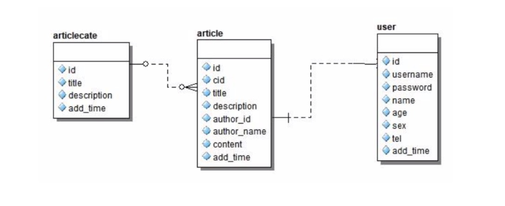

## mongodb 模块 直接粘代码

```
const { MongoClient } = require('mongodb');

const url = 'mongodb://127.0.0.1:27017';

const dbName = 'itying';

const client = new MongoClient(url, {
  useUnifiedTopology: true,
  auth: {
    user: 'admin',
    password: '123456',
  },
});

client.connect((err) => {
  if (err) {
    console.log('err', err);
    return;
  }
  console.log('数据库连接成功');
  let db = client.db(dbName);

  //1.查找数据

  // db.collection('user')
  //   .find({})
  //   .toArray((err, data) => {
  //     if (err) {
  //       console.log('查找错误err', err);
  //       return;
  //     }
  //     console.log('查询成功data', data);
  //   //操作数据库完毕后一定要关闭数据库
  //   client.close();
  //   });

  // //2.增加数据

  // db.collection('user').insertOne({ username: 'nodejs操作mongodb2', age: 10 }, (err, result) => {
  //   if (err) {
  //     console.log('增加失败err', err);
  //     return;
  //   }
  //   console.log('增加成功', result);

  //   //操作数据库完毕后一定要关闭数据库
  //   client.close();
  // });

  // 3.修改数据

  // db.collection('user').updateOne(
  //   { username: 'zhangsan' },
  //   { $set: { age: 10 } },
  //   (err, result) => {
  //     if (err) {
  //       console.log('修改失败err', err);
  //       return;
  //     }
  //     console.log('修改成功', result);
  //     //操作数据库完毕后一定要关闭数据库
  //     client.close();
  //   }
  // );

  // 4.删除数据

  // db.collection('user').deleteOne({ username: 'zhaosi' }, (err) => {
  //   if (err) {
  //     console.log('删除失败err', err);
  //     return;
  //   }
  //   console.log('删除一条数据成功');
  //   //操作数据库完毕后一定要关闭数据库
  //   client.close();
  // });

  // 5.删除多条数据

  db.collection('user').deleteMany({ username: 'zhaosi' }, (err) => {
    if (err) {
      console.log('删除失败err', err);
      return;
    }
    console.log('删除多条数据成功');
    //操作数据库完毕后一定要关闭数据库
    client.close();
  });
});

```

```
连接
 MongoClient.connect(
    url,
    {
      useUnifiedTopology: true,
      auth: {
        user: 'admin',
        password: '123456',
      },
    },
    (err, client) => {}
 )
```

## 推荐使用 mongoose 模块

> schema:为数据库对象的集合，每个 schema 会映射到 mongodb 中的一个 collection，定义 schema 可以理解为表结构

### 1. 连接数据库，增加数据

```
const mongoose = require('mongoose')
mongoose.connect('mongodb://127.0.0.1:27017/itying',{useNewUrlParser:true},(err)=>{
    if(err){
      console.log(err);
      return
    }
})

定义数据表（集合）的映射：字段名必须和数据库一致

var UserSchema = mongoose.Schema({
  username:String,
  age:Number,
})
定义model操作数据库
var UserModel = mongoose.model('User',UserSchema,'user');

var user = new UserModel({
  name:'zhangsan',
  age:30
})

user.save((err)=>{
  if(err){
    return
  }
})
```

### 2.预定义模式修饰符

> 对增加的数据进行格式化
> lowercase 小写
> uppercase 大写
> trim 去掉空格

```
var NewsSchema = mongoose.Schema({
  title:{
    type:String,
    trim:true  //去掉空格
  }
})
```

### 3. 自定义修饰符

Getters
只有在实例化时进行格式化，用处不多

Setters
将 redirect 字段拼接上 http://前缀 进行存储

```
var NewsSchema = mongoose.Schema({
  title:{
    type:String,
    trim:true,  //去掉空格
  },
  redirect:{
    type:String,
    set(params){
      //params可以获取redirect值  返回的数据就是redirect在数据库实际保存的值
    /*
      www.baidu.com   =>     http://www.baidu.com
      http://www.baidu.com  =>  http://www.baidu.com
    */
    if(!params){
      return ''
    }else{
      if(params.indexOf('http://')!=0 && params.indexOf('https://')!=0){
        return 'http://' + params;
      }
    }
  }
})
```

### 4.索引

```
var user = new UserModel({
  name:'zhangsan',
  age:30,
  sn:{
    type:String,
    index:true  //设置索引
  }
})
```

### 5.mongoose 内置 CURD

https://mongoosejs.com/docs/queries.html 文档地址

Model.deleteMany()
Model.deleteOne()
Model.find()
Model.findById()
Model.findByIdAndDelete()
Model.findByIdAndRemove()
Model.findByIdAndUpdate()
Model.findOne()
Model.findOneAndDelete()
Model.findOneAndRemove()
Model.findOneAndReplace()
Model.findOneAndUpdate()
Model.replaceOne()
Model.updateMany()
Model.updateOne()

### 6.扩展自定义静态方法

```
UserSchema.statics.findBySn=function(sn,cb){
  //this指向当前暴露的model userModel
  this.find({'sn':sn}),functions(err,docs){
    cb(err,docs)
  }
}

userModel.findBySn(('123123',cb)=>{

})
```

### 7.扩展实例方法

```
UserSchema.methods.print=function(sn,cb){
 //this指向实例
 console.log( this.name )
 console.log('我是一个实例方法')
}
var user = new UserModel({
  name:'zhangsan',
  age:30,

})
user.print()
```

### 8.mongoose 数据效验

具体功能请看代码注释

```
var user = new UserModel({
  name:{
    type:String,
    trim:true，      //修饰符去掉空格
    required:true   //必填
  },
  age:{
    type:Number,
    max:120,     //最大
    min:0,       //最小
    required:true,
  },
  sn:{
    type:String,
    index:true  //设置索引
    maxLength:20,    //长度限制
    minLength:10,
    match:/^sn(.*)/i   //要求以sn开头的正则表达式
  },
  status:{
    type:String,
    default:'1',
    enum:['0','1','2','3'] //status的值必须在对应数组里  注意枚举是用在String类型
  },
  height:{
    type:Number,
    //自定义效验 return true才能保存成功
    validate:(height){
      return height < 250
    }
  }
})
```

### 9.聚合管道查询。



```
//三个表关联查询
ArticleModel.aggregate([
{

    $lookup: {
      from: "articlecate",
      localField: "cid",
      foreignField: "_id",
      as: "cate"
    }

},
{

    $lookup: {
      from: "user",
      localField: "author_id",
      foreignField: "_id",
      as: "user"
    }

}

],function(err,docs){

console.log(JSON.stringify(docs));
})
```

### 10. populate 查询

1. 定义 ref

```
var ArticleSchema = new Schema({
  title: {
    type: String,
    unique: true,
  },
  cid: {
    type: Schema.Types.ObjectId,
    ref: 'ArticleCate', //model 的名称
  } /*分类 id*/,
  author_id: {
    type: Schema.Types.ObjectId,
    ref: 'User',
  }, //用户的 id
  author_name: {
    type: String,
  },
  descripton: String,
  content: String,
});

```

2.关联查询

```
ArticleModel.find({}).populate('cid').populate('author_id')
  .exec(function (err, docs) {
    console.log(docs);
  });
```
