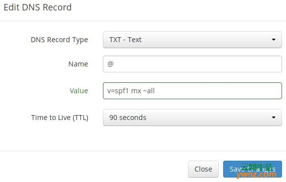
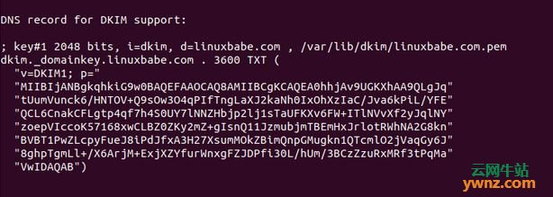
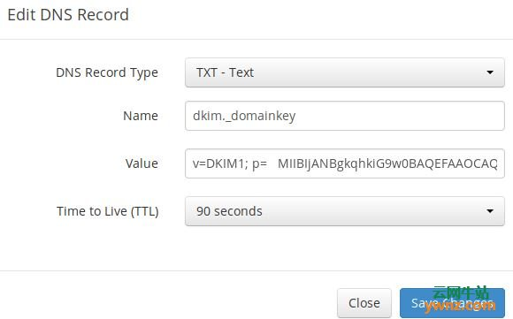

记录一次自搭建 smtp 服务器的过程。

1.首先有一台服务器。国内阿里云腾讯云等服务器不支持 25 端口,注意避坑。 我的服务器是 ubuntu 18.04 系统的。

2.准备一个域名 ，我的是阿里云买的。直接在阿里云控制台配置域名解析 ：
比如我的域名 ynxh.xyz。
一个 A 记录。主机记录 mail.ynxh.xyz 记录值为服务器 ip
一个 MX 记录。主机记录 @.ynxh.xyz 记录值为服务器 ip

3.配置主机名 SSH 进入你的服务器，然后更新软件包：

sudo apt update

sudo apt upgrade

然后使用以下命令为服务器设置完全限定的域名（FQDN）：

sudo hostnamectl set-hostname mail.your-domain.com

我们还需要更新/etc/hosts 文件：

sudo nano /etc/hosts

编辑如下：

127.0.0.1 mail.your-domain.com localhost

保存并关闭文件，要查看更改，请重新登录，然后运行以下命令以查看主机名：

hostname -f

4.对了，还需要配置 ssl 证书。可申请免费的 ssl 证书。服务器配置这部由小伙伴完成了，改天自己亲手尝试一下。

在 Nginx 中安装证书

获得 TLS 证书后，让我们配置 Nginx Web 服务器以使用它，编辑 SSL 模板文件：

sudo nano /etc/nginx/templates/ssl.tmpl

找到以下 2 行：

ssl_certificate /etc/ssl/certs/iRedMail.crt;

ssl_certificate_key /etc/ssl/private/iRedMail.key;

替换为：

ssl_certificate /etc/letsencrypt/live/mail.your-domain.com/fullchain.pem;

ssl_certificate_key /etc/letsencrypt/live/mail.your-domain.com/privkey.pem;

保存并关闭文件，然后测试 nginx 配置并重新加载：

sudo nginx -t

sudo systemctl reload nginx

5.参考 nodemailer 主页，使用 smtp-server + node 搭建 smtp 服务
https://nodemailer.com/about/

搭建成功也可以连接了，但是遇到了坑，不知如何解决。（如何创建邮件服务器账号？？比如a@ynxh.xyz）而且还缺少管理后台，还得手写。太麻烦了！

6.于是到处 google 发现了新大陆，iReadMail
官方文档在这：https://docs.iredmail.org/install.iredmail.on.debian.ubuntu-zh_CN.html
安装及使用 iRedMail 在 Ubuntu 18.04 上设置邮件服务器

7.下载最新版本的 iRedMail
根据服务器版本下载。https://www.iredmail.org/download.html
cd 到改目录
bash iRedMail.sh
运行安装程序后一路回车。中间需要配置你的本机域名，root 用户密码，数据库选择等。。。
这里可能会遇到无法安装成功的问题，其中一个原因是本机没有对应的数据库，我选择的是 mariaDb 请自行百度进行安装

安装 mariaDb 的时候发现报错：大概长这个样子

> mariadb-server : Depends: mariadb-server-10.4 (>= 1:10.4.7+maria~stretch) but it is not going to be installed 8.
> 我找到的解决方案：
> https://downloads.mariadb.org/mariadb/repositories/#distro=Debian&distro_release=stretch--stretch&mirror=ustc-hefei&version=10.4

运行以下命令
sudo apt-get install software-properties-common dirmngr
sudo apt-key adv --fetch-keys 'https://mariadb.org/mariadb_release_signing_key.asc'
sudo add-apt-repository 'deb [arch=amd64,arm64,i386,ppc64el] https://mirrors.ustc.edu.cn/mariadb/repo/10.4/debian stretch main'
然后再用 apt 安装即可。
sudo apt-get update
sudo apt-get install mariadb-server

安装好数据库后。自行百度。进行配置远程访问，权限访问之类的问题。

9.现在 iRedMail 安装完成
重新启动你的 Ubuntu 18.04 服务器：

sudo shutdown -r now

服务器重新联机后，可以访问 Web 管理面板，地址如下：

https://mail.your-domain.com/iredadmin/

10.现在已能发送和接收邮件。但是发送的邮件均被标记为垃圾邮件。怎么办？

提高你的电子邮件服务器信誉

要防止你的电子邮件被标记为垃圾邮件，应该设置PTR，SPF，DKIM和DMARC记录。

1、PTR记录

指针记录或PTR记录将IP地址映射到FQDN（完全限定的域名），它是A记录的对应物，用于反向DNS查找，可以帮助阻止垃圾邮件发送者，如果没有找到发送服务器的PTR记录，许多SMTP服务器会拒绝电子邮件。

要检查IP地址的PTR记录，请运行以下命令：

dig -x IP-address +short

或者：

host IP-address

因为你从你的托管服务提供商或ISP获得IP地址，而不是从你的域名注册商处获得IP地址，因此你必须在你的托管服务提供商的控制面板中为你的IP设置PTR记录，或者询问你的ISP，它的值应该是你的邮件服务器的主机名：mail.your-domain.com，如果你的服务器使用IPv6地址，请务必为你的IPv6地址添加PTR记录。

2、SPF记录

SPF（发件人策略框架）记录指定允许哪些主机或IP地址代表域发送电子邮件，你应该只允许自己的电子邮件服务器或ISP的服务器为你的域发送电子邮件，在DNS管理界面中，创建如下所示的新TXT记录：
- 
说明：

TXT表示这是TXT记录。

在名称字段中输入@表示主域名。

v=spf1表示这是SPF记录，版本为SPF1。

mx表示允许MX记录中列出的所有主机为你的域发送电子邮件，并且不允许所有其他主机。

~all表示来自你域的电子邮件应该只来自SPF记录中指定的主机，来自其他主机的电子邮件将被标记为伪造。

要检查你的SPF记录是否传播到公共Internet，你可以在Linux机器上使用dig实用程序，如下所示：

dig your-domain.com txt

txt选项告诉dig我们只想查询TXT记录。

3、DKIM记录

DKIM（DomainKeys Identified Mail）使用私钥对从你的域发送的电子邮件进行数字签名，接收SMTP服务器使用公钥验证签名，该公钥在DNS DKIM记录中发布。

iRedMail脚本自动为你的服务器配置DKIM，剩下要做的唯一事情是在DNS管理器中创建DKIM记录，打开iRedMail-0.9.8目录下的iRedMail.tips文件：

sudo nano iRedMail.tips

向下滚动到DKIM支持部分的DNS记录，DKIM公钥位于括号中，如图：
- 
还可以使用以下命令显示公钥：

sudo amavisd-new showkeys

然后在DNS管理器中创建TXT记录，在名称字段中输入dkim._domainkey，复制括号中的所有内容并粘贴到值字段中，删除所有双引号：
- 
保存更改后，运行以下命令以测试DKIM记录是否正确：

sudo amavisd-new testkeys

如果DKIM记录正确，则测试将通过，请注意，你的DNS记录可能需要一段时间才能传播到Internet：

TESTING#1 linuxbabe.com: dkim._domainkey.linuxbabe.com => pass

4、DMARC记录

DMARC代表基于域的消息认证，报告和一致性，DMARC可以帮助接收电子邮件服务器以识别合法电子邮件，并防止你的域名被电子邮件欺骗使用。

要创建DMARC记录，请转到DNS管理器并添加TXT记录，在名称字段中，输入_dmarc，在值字段中，输入以下内容：

v=DMARC1; p=none; pct=100; rua=mailto:dmarc-reports@your-domain.com
- 

上述DMARC记录是一个安全的起点。

 

11.测试电子邮件分数和位置

创建PTR，SPF，DKIM记录后，请访问：https://www.mail-tester.com，你将看到一个唯一的电子邮件地址，从你的域发送电子邮件到此地址，然后检查你的分数，如你所见，我得到了一个完美的分数，在测试结果中，你应检查你的PTR记录，SPF和DKIM记录是否有效：

imporve email server reputationMail-tester.com只能显示发件人得分，还有另一项名为GlockApps的服务，可让你检查你的电子邮件是否落在收件人的收件箱或垃圾邮件文件夹中，或者直接拒绝，它支持许多流行的电子邮件提供商，如Gmail、Outlook、Hotmail、YahooMail、iCloud邮件等：

附：禁用Greylisting

默认情况下，iRedMail已启用Greylisting，这会告诉其他发送SMTP服务器在几分钟后再次尝试，这主要用于阻止垃圾邮件，但也会降低用户体验，如果你想禁用Greylisting，请按照以下说明操作。

添加写入权限到/opt/iredapd/settings.py文件：

sudo chmod 600 /opt/iredapd/settings.py

然后编辑配置文件：

sudo nano /opt/iredapd/settings.py

找到以下行：

plugins = ["reject_null_sender", "wblist_rdns", "reject_sender_login_mismatch", "greylisting", "throttle", "amavisd_wblist", "sql_alias_access_policy"]

从列表中删除“greylisting”，保存并关闭文件，然后重启iredapd：

sudo systemctl restart iredapd

将配置文件更改回只读模式：

sudo chmod 400 /opt/iredapd/settings.py

 

结语

以上就是在Ubuntu 18.04上使用iRedMail设置邮件服务器的步骤，如果你不需要TLS证书，那就不需要做证书配置的操作。同时声明一下设置备份邮件服务器的思路，你的主邮件服务器有时可能会关闭，如果你在数据中心托管邮件服务器，那么停机时间非常短，因此你不必担心丢失入站电子邮件，如果你在家中托管邮件服务器，则无法预测停机时间，因此在数据中心运行备份邮件服务器以防止丢失入站电子邮件是一种很好的做法，备份邮件服务器只需要512MB RAM即可运行。

tip：
1.允许某些用户以其他用户的身份发送电子邮件
当发件人为MAIL FROM地址（From:标头）指定所有者，但未以该MAIL FROM地址所有者的身份登录（SASL）时，iRedMail将Postfix配置为拒绝请求。或当客户端（SASL）登录但客户端登录名不拥有MAIL FROM地址时。

有时我们确实需要以其他用户的身份发送电子邮件，本教程介绍了如何允许某些用户使用iRedAPD插件执行此操作 reject_sender_login_mismatch

    删除reject_sender_login_mismatch后缀设置smtpd_sender_restrictions（/etc/postfix/main.cf）中的限制规则。iRedAPD插件将为您执行相同的限制。
    删除后reject_sender_login_mismatch，Postfix设置如下所示：
>smtpd_sender_restrictions = permit_mynetworks, permit_sasl_authenticated
    reject_sender_login_mismatch在iRedAPD配置文件中 启用插件/opt/iredapd/settings.py：
>plugins = ['reject_sender_login_mismatch', ...]
    /opt/iredapd/settings.py在参数iRedAPD配置文件中 列出允许以不同用户身份发送电子邮件的发件人ALLOWED_LOGIN_MISMATCH_SENDERS。例如：
>ALLOWED_LOGIN_MISMATCH_SENDERS = ['user1@here.com', 'user2@here.com']
>NOTE: this parameter does not present by default, please add it manually.
    重新启动iRedAPD服务。就这样
service iredapd restart