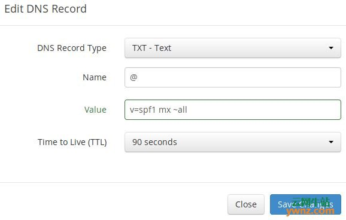
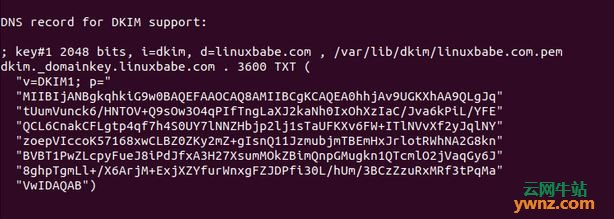
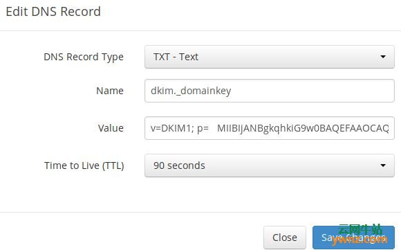
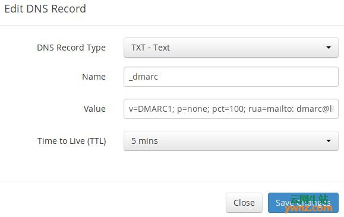

记录一次自搭建 邮件服务器的过程。

1.首先有一台服务器。国内阿里云腾讯云等服务器不支持 25 端口,注意避坑。 我的服务器是 ubuntu 18.04 系统的。

2.准备一个域名 ，我的是阿里云买的。直接在阿里云控制台配置域名解析 ：
比如我的域名 your-domain.com。
一个 A 记录。主机记录 mail.your-domain.com 记录值为服务器 ip
一个 MX 记录。主机记录 @.your-domain.com 记录值为服务器 ip

3.配置主机名 SSH 进入你的服务器，然后更新软件包：

sudo apt update

sudo apt upgrade

然后使用以下命令为服务器设置完全限定的域名（FQDN）：

sudo hostnamectl set-hostname mail.your-domain.com

我们还需要更新/etc/hosts 文件：

sudo nano /etc/hosts

编辑如下：

127.0.0.1 mail.your-domain.com localhost

保存并关闭文件，要查看更改，请重新登录，然后运行以下命令以查看主机名：

hostname -f

4.对了，还需要配置 ssl 证书。可申请免费的 ssl 证书。服务器配置这部由小伙伴完成了，改天自己亲手尝试一下。

在 Nginx 中安装证书

获得 TLS 证书后，让我们配置 Nginx Web 服务器以使用它，编辑 SSL 模板文件：

sudo nano /etc/nginx/templates/ssl.tmpl

找到以下 2 行：

ssl_certificate /etc/ssl/certs/iRedMail.crt;

ssl_certificate_key /etc/ssl/private/iRedMail.key;

替换为：

ssl_certificate /etc/letsencrypt/live/mail.your-domain.com/fullchain.pem;

ssl_certificate_key /etc/letsencrypt/live/mail.your-domain.com/privkey.pem;

保存并关闭文件，然后测试 nginx 配置并重新加载：

sudo nginx -t

sudo systemctl reload nginx

安装 Let 的加密 TLS 证书

由于邮件服务器使用的是自签名 TLS 证书，因此桌面邮件客户端用户和 Webmail 客户端用户都会看到警告，要解决此问题，我们可以获取并安装免费的 Let's Encrypt TLS 证书。

1、获得证书

首先，在 Ubuntu 18.04 上安装 Let 的 Encrypt（certbot）客户端：

sudo apt install software-properties-common

sudo add-apt-repository ppa:certbot/certbot

sudo apt install certbot

参考：使用 Certbot：在 Linux 上安装 letsencrypt 的最简单方法。

iRedMail 已经在默认的 Nginx 虚拟主机中配置了 TLS 设置，因此我建议使用 webroot 插件而不是 nginx 插件来获取证书，运行以下命令，请替换 your-email-address 及 mail.your-domain.com：

sudo certbot certonly --webroot --agree-tos --email your-email-address -d mail.your-domain.com -w /var/www/html/

当它询问是否要接收 EFF 的通讯时，可以选择否：

安装及使用 iRedMail 在 Ubuntu 18.04 上设置全功能邮件服务器的步骤

如果一切顺利，将成功获得 TLS 证书，你的证书和链已保存在/etc/letsencrypt/live/mail.your-domain.com/目录中。

在 Postfix 和 Dovecot 中安装 TLS 证书

我们还需要配置 Postfix SMTP 服务器和 Dovecot IMAP 服务器以使用 Let's Encrypt 颁发的证书，以便桌面邮件客户端不会显示安全警告，编辑 Postfix 的主配置文件：

sudo nano /etc/postfix/main.cf

找到以下 3 行（第 95,96,97 行）：

smtpd_tls_key_file = /etc/ssl/private/iRedMail.key

smtpd_tls_cert_file = /etc/ssl/certs/iRedMail.crt

smtpd_tls_CAfile = /etc/ssl/certs/iRedMail.crt

替换为：

smtpd_tls_key_file = /etc/letsencrypt/live/mail.your-domain.com/privkey.pem

smtpd_tls_cert_file = /etc/letsencrypt/live/mail.your-domain.com/cert.pem

smtpd_tls_CAfile = /etc/letsencrypt/live/mail.your-domain.com/chain.pem

保存并关闭文件，然后重新加载 Postfix：

sudo systemctl reload postfix

接下来，编辑 Dovecot 的主配置文件：

sudo nano /etc/dovecot/dovecot.conf

处理以下 2 行（第 47,48 行）：

ssl_cert = </etc/ssl/certs/iRedMail.crt

ssl_key = </etc/ssl/private/iRedMail.key

替换为：

ssl_cert = </etc/letsencrypt/live/mail.your-domain.com/fullchain.pem

ssl_key = </etc/letsencrypt/live/mail.your-domain.com/privkey.pem

保存并关闭文件，然后重装 dovecot：

sudo systemctl reload dovecot

从现在开始，桌面邮件用户将看不到安全警告。

5.参考 nodemailer 主页，使用 smtp-server + node 搭建 smtp 服务
https://nodemailer.com/about/

搭建成功也可以连接了，但是遇到了坑，不知如何解决。（如何创建邮件服务器账号？？比如a@your-domain.com）而且还缺少管理后台，还得手写。太麻烦了！

6.于是到处 google 发现了新大陆，iReadMail
官方文档在这：https://docs.iredmail.org/install.iredmail.on.debian.ubuntu-zh_CN.html
安装及使用 iRedMail 在 Ubuntu 18.04 上设置邮件服务器

7.下载最新版本的 iRedMail
根据服务器版本下载。https://www.iredmail.org/download.html
cd 到改目录
bash iRedMail.sh
运行安装程序后一路回车。中间需要配置你的本机域名，root 用户密码，数据库选择等。。。
这里可能会遇到无法安装成功的问题，其中一个原因是本机没有对应的数据库，我选择的是 mariaDb 请自行百度进行安装

安装 mariaDb 的时候发现报错：大概长这个样子

> mariadb-server : Depends: mariadb-server-10.4 (>= 1:10.4.7+maria~stretch) but it is not going to be installed 8.
> 我找到的解决方案：
> https://downloads.mariadb.org/mariadb/repositories/#distro=Debian&distro_release=stretch--stretch&mirror=ustc-hefei&version=10.4

运行以下命令
sudo apt-get install software-properties-common dirmngr
sudo apt-key adv --fetch-keys 'https://mariadb.org/mariadb_release_signing_key.asc'
sudo add-apt-repository 'deb [arch=amd64,arm64,i386,ppc64el] https://mirrors.ustc.edu.cn/mariadb/repo/10.4/debian stretch main'
然后再用 apt 安装即可。
sudo apt-get update
sudo apt-get install mariadb-server

安装好数据库后。自行百度。进行配置远程访问，权限访问之类的问题。

9.现在 iRedMail 安装完成
重新启动你的 Ubuntu 18.04 服务器：

sudo shutdown -r now

服务器重新联机后，可以访问 Web 管理面板，地址如下：

https://mail.your-domain.com/iredadmin/

10.现在已能发送和接收邮件。但是发送的邮件均被标记为垃圾邮件。怎么办？

提高你的电子邮件服务器信誉

要防止你的电子邮件被标记为垃圾邮件，应该设置 PTR，SPF，DKIM 和 DMARC 记录。

1、PTR 记录

指针记录或 PTR 记录将 IP 地址映射到 FQDN（完全限定的域名），它是 A 记录的对应物，用于反向 DNS 查找，可以帮助阻止垃圾邮件发送者，如果没有找到发送服务器的 PTR 记录，许多 SMTP 服务器会拒绝电子邮件。

要检查 IP 地址的 PTR 记录，请运行以下命令：

dig -x IP-address +short

或者：

host IP-address

因为你从你的托管服务提供商或 ISP 获得 IP 地址，而不是从你的域名注册商处获得 IP 地址，因此你必须在你的托管服务提供商的控制面板中为你的 IP 设置 PTR 记录，或者询问你的 ISP，它的值应该是你的邮件服务器的主机名：mail.your-domain.com，如果你的服务器使用 IPv6 地址，请务必为你的 IPv6 地址添加 PTR 记录。

2、SPF 记录

SPF（发件人策略框架）记录指定允许哪些主机或 IP 地址代表域发送电子邮件，你应该只允许自己的电子邮件服务器或 ISP 的服务器为你的域发送电子邮件，在 DNS 管理界面中，创建如下所示的新 TXT 记录：

- 
  说明：

TXT 表示这是 TXT 记录。

在名称字段中输入@表示主域名。

v=spf1 表示这是 SPF 记录，版本为 SPF1。

mx 表示允许 MX 记录中列出的所有主机为你的域发送电子邮件，并且不允许所有其他主机。

~all 表示来自你域的电子邮件应该只来自 SPF 记录中指定的主机，来自其他主机的电子邮件将被标记为伪造。

要检查你的 SPF 记录是否传播到公共 Internet，你可以在 Linux 机器上使用 dig 实用程序，如下所示：

dig your-domain.com txt

txt 选项告诉 dig 我们只想查询 TXT 记录。

3、DKIM 记录

DKIM（DomainKeys Identified Mail）使用私钥对从你的域发送的电子邮件进行数字签名，接收 SMTP 服务器使用公钥验证签名，该公钥在 DNS DKIM 记录中发布。

iRedMail 脚本自动为你的服务器配置 DKIM，剩下要做的唯一事情是在 DNS 管理器中创建 DKIM 记录，打开 iRedMail-0.9.8 目录下的 iRedMail.tips 文件：

sudo nano iRedMail.tips

向下滚动到 DKIM 支持部分的 DNS 记录，DKIM 公钥位于括号中，如图：

- 
  还可以使用以下命令显示公钥：

sudo amavisd-new showkeys

然后在 DNS 管理器中创建 TXT 记录，在名称字段中输入 dkim.\_domainkey，复制括号中的所有内容并粘贴到值字段中，删除所有双引号：

- 
  保存更改后，运行以下命令以测试 DKIM 记录是否正确：

sudo amavisd-new testkeys

如果 DKIM 记录正确，则测试将通过，请注意，你的 DNS 记录可能需要一段时间才能传播到 Internet：

TESTING#1 linuxbabe.com: dkim.\_domainkey.linuxbabe.com => pass

4、DMARC 记录

DMARC 代表基于域的消息认证，报告和一致性，DMARC 可以帮助接收电子邮件服务器以识别合法电子邮件，并防止你的域名被电子邮件欺骗使用。

要创建 DMARC 记录，请转到 DNS 管理器并添加 TXT 记录，在名称字段中，输入\_dmarc，在值字段中，输入以下内容：

v=DMARC1; p=none; pct=100; rua=mailto:dmarc-reports@your-domain.com

- 

上述 DMARC 记录是一个安全的起点。

11.测试电子邮件分数和位置

创建 PTR，SPF，DKIM 记录后，请访问：https://www.mail-tester.com，你将看到一个唯一的电子邮件地址，从你的域发送电子邮件到此地址，然后检查你的分数，如你所见，我得到了一个完美的分数，在测试结果中，你应检查你的PTR记录，SPF和DKIM记录是否有效：

imporve email server reputationMail-tester.com 只能显示发件人得分，还有另一项名为 GlockApps 的服务，可让你检查你的电子邮件是否落在收件人的收件箱或垃圾邮件文件夹中，或者直接拒绝，它支持许多流行的电子邮件提供商，如 Gmail、Outlook、Hotmail、YahooMail、iCloud 邮件等：

附：禁用 Greylisting

默认情况下，iRedMail 已启用 Greylisting，这会告诉其他发送 SMTP 服务器在几分钟后再次尝试，这主要用于阻止垃圾邮件，但也会降低用户体验，如果你想禁用 Greylisting，请按照以下说明操作。

添加写入权限到/opt/iredapd/settings.py 文件：

sudo chmod 600 /opt/iredapd/settings.py

然后编辑配置文件：

sudo nano /opt/iredapd/settings.py

找到以下行：

plugins = ["reject_null_sender", "wblist_rdns", "reject_sender_login_mismatch", "greylisting", "throttle", "amavisd_wblist", "sql_alias_access_policy"]

从列表中删除“greylisting”，保存并关闭文件，然后重启 iredapd：

sudo systemctl restart iredapd

将配置文件更改回只读模式：

sudo chmod 400 /opt/iredapd/settings.py

结语

以上就是在 Ubuntu 18.04 上使用 iRedMail 设置邮件服务器的步骤，如果你不需要 TLS 证书，那就不需要做证书配置的操作。同时声明一下设置备份邮件服务器的思路，你的主邮件服务器有时可能会关闭，如果你在数据中心托管邮件服务器，那么停机时间非常短，因此你不必担心丢失入站电子邮件，如果你在家中托管邮件服务器，则无法预测停机时间，因此在数据中心运行备份邮件服务器以防止丢失入站电子邮件是一种很好的做法，备份邮件服务器只需要 512MB RAM 即可运行。

tip： 1.允许某些用户以其他用户的身份发送电子邮件
当发件人为 MAIL FROM 地址（From:标头）指定所有者，但未以该 MAIL FROM 地址所有者的身份登录（SASL）时，iRedMail 将 Postfix 配置为拒绝请求。或当客户端（SASL）登录但客户端登录名不拥有 MAIL FROM 地址时。

有时我们确实需要以其他用户的身份发送电子邮件，本教程介绍了如何允许某些用户使用 iRedAPD 插件执行此操作 reject_sender_login_mismatch

    删除reject_sender_login_mismatch后缀设置smtpd_sender_restrictions（/etc/postfix/main.cf）中的限制规则。iRedAPD插件将为您执行相同的限制。
    删除后reject_sender_login_mismatch，Postfix设置如下所示：

> smtpd_sender_restrictions = permit_mynetworks, permit_sasl_authenticated

    reject_sender_login_mismatch在iRedAPD配置文件中 启用插件/opt/iredapd/settings.py：

> plugins = ['reject_sender_login_mismatch', ...]

    /opt/iredapd/settings.py在参数iRedAPD配置文件中 列出允许以不同用户身份发送电子邮件的发件人ALLOWED_LOGIN_MISMATCH_SENDERS。例如：

> ALLOWED_LOGIN_MISMATCH_SENDERS = ['user1@here.com', 'user2@here.com']
> NOTE: this parameter does not present by default, please add it manually.

    重新启动iRedAPD服务。就这样

service iredapd restart

由于我的服务器内存较低。病毒查杀的进程内存占用较高。因此
禁用垃圾邮件病毒扫描以检查外发邮件!!!!!

要禁用垃圾邮件/病毒对外发邮件的扫描，可以在Amavisd配置文件中添加绕过设置：/etc/amavisd/amavisd.conf（RHEL / CentOS）或 /etc/amavis/conf.d/50-user（Debian / Ubuntu）或/usr/local/etc/amavisd.conf （FreeBSD）。

这些设置可以添加到设置块中$policy_bank{'ORIGINATING'}：

$policy_bank{'ORIGINATING'} = {
    [...OMIT OTHER SETTINGS HERE...]

    # don't perform spam/virus/header check.
    bypass_spam_checks_maps => [1],
    bypass_virus_checks_maps => [1],
    bypass_header_checks_maps => [1],

    # allow sending any file names and types
    bypass_banned_checks_maps => [1],
}
更改设置后，需要重新启动Amavisd服务。

然后。重点！发现上述步骤执行后。内存占用被某进程clams占用
停止病毒/垃圾邮件扫描，保持DKIM签名/验证和免责声明

如果要禁用病毒和垃圾邮件扫描，但保留DKIM签名和免责声明，请尝试以下操作：

保留content_filter = smtp-amavis:[127.0.0.1]:10024在Postfix配置文件中/etc/postfix/main.cf。

在Amavisd配置文件中找到以下几行：

在RHEL / CentOS上， /etc/amavisd/amavisd.conf
在Debian / Ubuntu上， /etc/amavis/conf.d/50-user
在FreeBSD上， /usr/local/etc/amavisd.conf
在OpenBSD上， /etc/amavisd.conf
# @bypass_virus_checks_maps = (1);  # controls running of anti-virus code
# @bypass_spam_checks_maps  = (1);  # controls running of anti-spam code
取消注释以上各行（在每行开头删除“＃”），然后重新启动Amavisd服务。

/etc/init.d/amavis restart

您可能想要停止并禁用ClamAV服务，然后删除clamav软件包，因为Amavisd或其他程序不再调用它：

在具有systemd支持的Linux系统上，您可以保留软件包，但保留mask clamav服务，以防止其被其他应用程序使用以下命令启动：

# CentOS
systemctl mask clamd@amavisd

# Debian/Ubuntu
systemctl mask clamav-daemon clamav-freshclam

然后把他禁止并移除 
# CentOS
systemctl disable --now clamd@amavisd
systemctl restart amavisd
yum remove clamav clamav-lib

# Debian/Ubuntu
systemctl disable --now clamav-daemon
systemctl restart amavis
apt remove clamav-base

# FreeBSD
sysrc -f /etc/rc.conf.local clamd=no
systemctl restart amavisd
pkg remove clamav

# OpenBSD
rcctl disable clamd
rcctl restart amavisd
pkg_delete clamav

创建一个新的邮件用户
用法示例：

example.com首先使用iRedAdmin创建邮件域名。
使用shell脚本创建一个新的邮件用户：

警告

请始终用单引号将密码引起来。

cd iRedMail-0.9.6/tools/
bash create_mail_user_SQL.sh user1@example.com 'plain_password'
它将打印用于创建此新用户的SQL命令，您可以将其保存到文件中，然后以root用户身份登录到SQL Server并导入该文件。例如：

MySQL或MariaDB：
# cd iRedMail-0.9.6/tools/
# bash create_mail_user_SQL.sh user1@example.com 'plain_password' > user.sql

# mysql -uroot -p
sql> USE vmail;
sql> SOURCE user.sql;

笔记：

密码方案是在变量中定义的PASSWORD_SCHEME，默认值为SSHA512。 BCRYPT建议在FreeBSD和OpenBSD上使用。
每个用户的邮箱配额在变量中定义DEFAULT_QUOTA，默认值为 1024（MB）。使用0无限的配额。
Maildir路径像一样散列 domain.ltd/u/s/e/username-20150929。如果您愿意domain.ltd/username/，请设置MAILDIR_STYLE='normal'。
邮箱存储路径是在变量中定义的STORAGE_BASE_DIRECTORY，默认值为/var/vmail/vmail1。

创建多个邮件用户
使用一些Shell脚本技巧，可以轻松地创建许多邮件用户。只需多次运行脚本，然后将输出SQL命令附加到同一文件即可。

# Create first user. With '>' to create or truncate file `/tmp/users.sql`.
bash create_mail_user_SQL.sh user1@domain.com 'password' > /tmp/users.sql

# Append users. With '>>' to append to `/tmp/users.sql`.
bash create_mail_user_SQL.sh user2@domain.com 'password' >> /tmp/users.sql
bash create_mail_user_SQL.sh user3@domain.com 'password' >> /tmp/users.sql
bash create_mail_user_SQL.sh user4@domain.com 'password' >> /tmp/users.sql
然后导入/tmp/users.sql一次即可同时创建它们。

ngxin 配置 追加到site-enable中

这是布置我的前端邮件项目。自己改下ip。用http-serve运行在8000端口

server {
        listen       8000;
        server_name  167.99.222.188;

        #charset koi8-r;

        #access_log  logs/host.access.log  main;

        location / {
            root   /root/mail-client/dist;
            index  index.html index.htm;
        }
       
        add_header Access-Control-Allow-Origin "*";
        default_type 'text/html';
        underscores_in_headers on;
        charset utf-8;
        #error_page  404              /404.html;
   
	}

  后端路径root/mail-project  pm2进程 启动就行了

  然后注意。在上传路径 root/mail-project-upload 下新建一个 polling.txt 文件用于记录轮询 （本地测试能够自动创建。服务器部署后无法自动创建，怀疑是权限问题，没处理。手动创建个吧。。）

还有新版本的数据库有点问题。参照mariadb和mysql重置密码 这篇文章进行处理下才能连接上数据库！！！