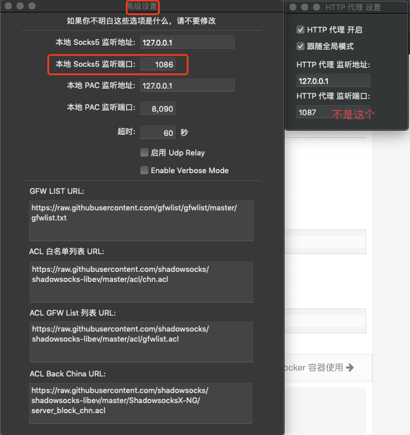

环境：

macOS macOS Big Sur 11.4
iTrem 2 3.4.8
shadowsockes 1.4.4-R8

查看自己命令行的状态

```bash
curl ip.gs
```

# 正式开始

### 一、首先检查自己的酸酸乳是否正常，并在高级设置页面，找到本地 Sock5 监听端口，我自己是 1086，注意这里还有一个 HTTP 代理监听端口，不是这个

- 

### 二、安装需要的软件（没有 brew 就先安装 brew，具体自行搜索哈）

```bash
brew install privoxy
```

### 三、配置 privoxy

```bash
vim /usr/local/etc/privoxy/config
```

在里面插入两行，

```bash
listen-address 0.0.0.0:8118
forward-socks5 / localhost:1086 .
```

> 注意！！！ 这里的 1086 就是刚才上面圈出来的端口，千万不要弄错了，弄错了就用不了的

### 四、启动 prioxy

```bash
sudo /usr/local/sbin/privoxy /usr/local/etc/privoxy/config
```

查看是否成功

```bash
netstat -na | grep 8118
```

看到有类似如下信息就表示启动成功了

```bash
tcp4 0 0 *.8118 *.* LISTEN
```

### 五、最后一步，方便使用

在 ~/.zshrc 里加入开关函数，使用起来更方便

```bash
vim ~/.zshrc
```

在里面插入

```
function proxy_off(){
    unset http_proxy
    unset https_proxy
    echo -e "已关闭代理"
}

function proxy_on() {
    export no_proxy="localhost,127.0.0.1,localaddress,.localdomain.com"
    export http_proxy="http://127.0.0.1:8118"
    export https_proxy=$http_proxy
    echo -e "已开启代理"
}
```

再 source 一下

```bash
source  ~/.zshrc

```

> 然后就可以通过在命令行输入 proxy_on 和 proxy_off 来开启和关闭代理啦

### 六、日常开启 prioxy 软件

```bash
brew services start privoxy
```

### 七、日常使用步骤

```bash
先启动 provixy 软件
brew services start privoxy
然后 启动代理
proxy_on
```

最后在看看自己的命令行状态吧

```bash
curl ip.gs
```
